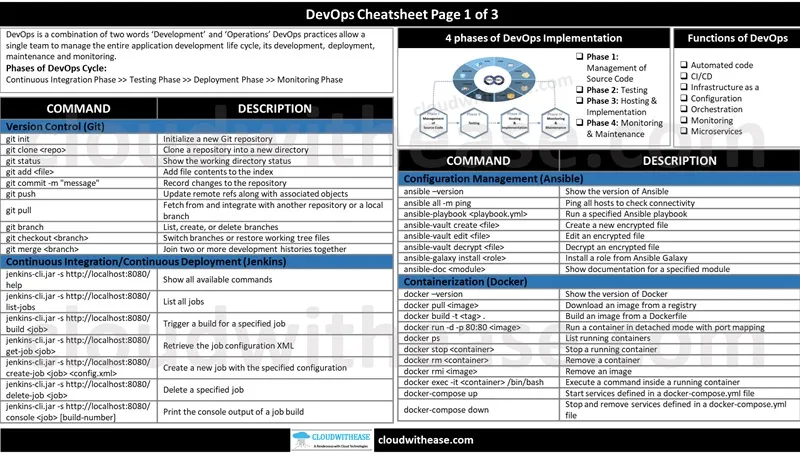
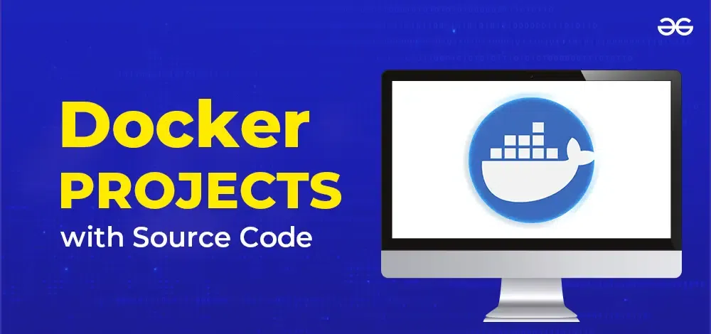

# DevOps Interview Preparation [
:information_source: &nbsp;This repo will have information on the resources and also way to crack interview with best package available in the market.

:warning: &nbsp;You can use these for preparing for an interview but most of the questions and exercises don't represent an actual interview.

:stop_sign: &nbsp;If you are interested in pursuing a career as DevOps engineer, learning some of the concepts mentioned here would be useful, but you should know it's not about learning all the topics and technologies mentioned in this repository

<table>
  <tr>
    <td align="center"><a href="https://github.com/bregman-arie/devops-exercises"> <b>DevOps Exercises</b></a></td>
    <td align="center"><a href="https://github.com/bregman-arie/python-exercises"> <b>Python exercises</b></a></td>
    <td align="center"><a href="https://github.com/bregman-arie/devops-resources"> <b>DevOps Resources</b></a></td>
    <td align="center"><a href="https://github.com/mamun001/terraform_interview_questions/blob/main/101_terraform_interview_questions.md"> <b>101 Terraform Interview Questions</b></a></td>
  </tr>
  <tr>
    <td align="center"><a href="https://github.com/vijaybiradar/DevOps-AWS-Interview-QA"> <b>DevOps-AWS-Interview-Q&A</b></a></td>
    <td align="center"><a href="https://cheatography.com/tag/devops/"> <b>DevOps Cheatsheets</b></a></td>
    <td align="center"><a href="https://github.com/ankitpro/DevOps-Interview-Preparation/blob/main/careerTransition.md"> <b>Skills Trend Info</b></a></td>
    <td align="center"><a href="https://github.com/Ebazhanov/linkedin-skill-assessments-quizzes/blob/main/README.md"> <b>Skill Assesement Quizzes</b></a></td>
  </tr>
  <tr>
    <td align="center"><a href="https://github.com/yousinix/portfolYOU?tab=readme-ov-file"> <b>Create Portfolio Website with GitHub pages</b></a></td>
    <td align="center"><a href="https://github.com/ripienaar/free-for-dev/blob/master/README.md"> <b>Curated Info of Free Softwares</b></a></td>
    <td align="center"><a href="https://github.com/MichaelCade/90DaysOfDevOps/tree/main"> <b>90 Days of Devops</b></a></td>
    <td align="center"><a href="https://github.com/milanm/DevOps-Roadmap/blob/master/README.md"> <b>DevOps Roadmap</b></a></td>
  </tr>
  <tr>
    <td align="center"><a href="https://github.com/veggiemonk/awesome-docker/blob/master/README.md"> <b>Curated List of Docker Resources and Projects</b></a></td>
  </tr>
</table>

---

### Page is still under construction. Will keep updating it as and when possible. Keep watching for more updates.

---

## Feedback

If you have any feedback, please reach out to me at [ankitagarwalpro@gmail.com](mailto:ankitagarwalpro@gmail.com) 

---

## Contributing

Contributions are always welcome!

:pencil: &nbsp;You can add more exercises by submitting pull requests :) Read about contribution guidelines [here](CONTRIBUTING.md)

---

## 📫 **Connect with Me**

---

## Author

- [Ankit Agarwal](https://github.com/ankitpro)
